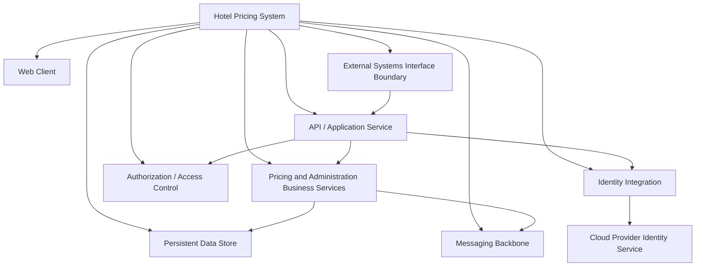
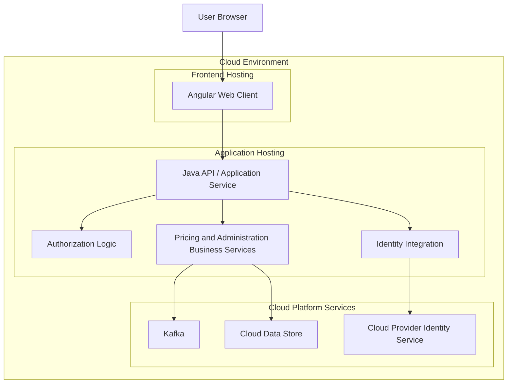
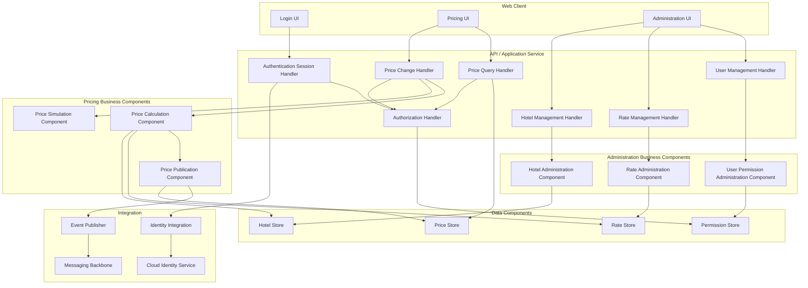
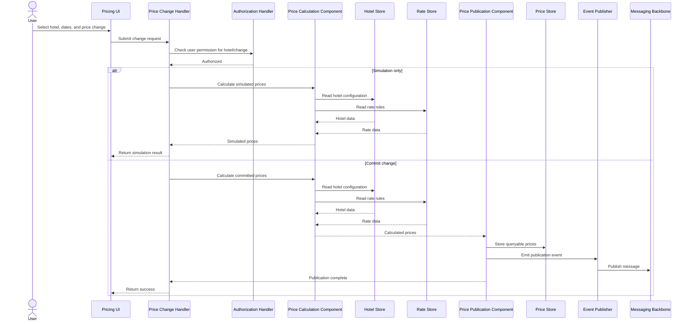
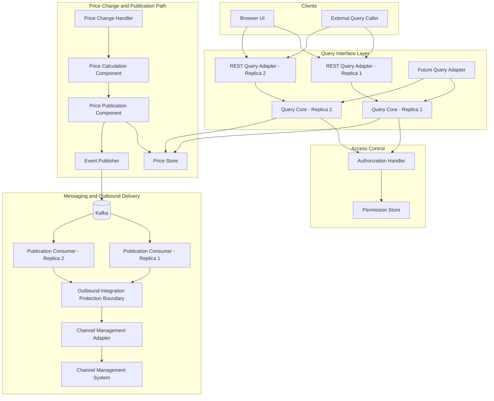
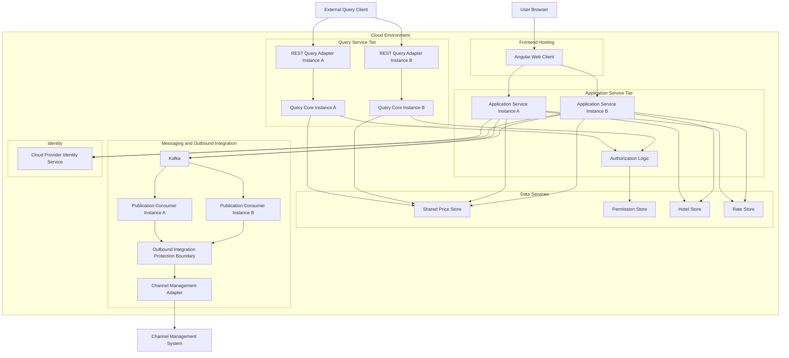
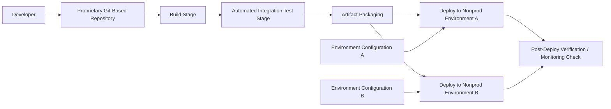
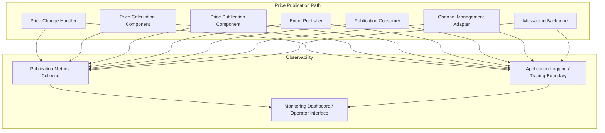
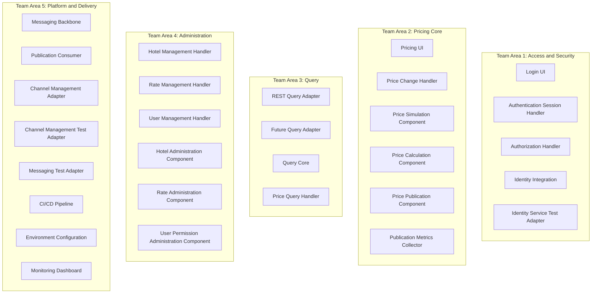

# Software Architecture (2026) — Assignment 2 Report

**AI Paradigm:** Single-Agent (Sequential reasoning + self-reflection)
**LLM Used:** gpt-5.4
**Session Start:** 2026-06-09 20:02:54.751
**Session End:** 2026-06-09 20:10:31.678

---

## II. Interaction Cost Analysis

| Metric | Value |
|--------|-------|
| Way of completing | Single-Agent (Option 2) |
| LLM used | gpt-5.4 |
| Number of human interactions (turns) | 5 |
| Prompt tokens | Not recorded |
| Completion tokens | Not recorded |
| Total token consumption (K tokens) | Not recorded |
| Time cost (min) | *fill in* |

---

## I. Output Results of ADD

### ADD Step 1: Review Inputs

# ADD Step 1: Review Inputs

## 1. Design Purpose

The Hotel Pricing System (HPS) is a **greenfield replacement** of an existing system. The design purpose is to make the **initial architectural decisions** needed to support building the system from scratch.

Implications for architecture:
- Establish an initial overall structure early.
- Support both a fast MVP and a production-ready evolution path.
- Make decisions that reduce technical debt while fitting the 6-month delivery constraint.
- Favor cloud-native deployment and integration with cloud-hosted services.

---

## 2. Primary Use Cases

### HPS-1: Log In
A commercial or administrator user provides credentials through a login window. The system validates credentials against a user identity service and, on success, grants access. Logged-in users may only query or modify hotels they are authorized to access.

### HPS-2: Change Prices
A user selects an authorized hotel and dates, then changes either a base rate or fixed rate. Derived prices are calculated at that point. The system supports simulation before committing changes. Once committed, prices are pushed to the Channel Management System and become available for query by external systems.

### HPS-3: Query Prices
A user or external system queries prices for a given hotel through the UI or a query API.

### HPS-4: Manage Hotels
An administrator adds, changes, or modifies hotel information, including tax rates, available rates, and room types.

### HPS-5: Manage Rates
An administrator adds, changes, or modifies rates, including the business rules used to calculate rates.

### HPS-6: Manage Users
An administrator changes permissions for a given user.

---

## 3. Quality Attribute Scenarios, Ranked by Importance and Difficulty

### High Importance / High Difficulty
These are the strongest architectural drivers.

1. **QA-1 Performance**  
   Scenario: When a base rate price is changed for a specific hotel and date during normal operation, prices for all rates and room types for that hotel must be published and ready for query in **less than 100 ms**.  
   Associated use case: HPS-2

2. **QA-2 Reliability**  
   Scenario: For multiple price changes on a given hotel, **100%** of the price changes must be published successfully and also received by the Channel Management System.  
   Associated use case: HPS-2

3. **QA-3 Availability**  
   Scenario: Pricing queries must achieve **99.9% uptime SLA** outside maintenance windows.  
   Associated use case: All

4. **QA-4 Scalability**  
   Scenario: The system must initially support **100,000 price queries/day** through its API and scale up to **1,000,000 queries/day** without decreasing average latency by more than **20%**.  
   Associated use case: HPS-3

### High Importance / Medium Difficulty
These are strong drivers because they affect access control and system structure.

5. **QA-5 Security**  
   Scenario: A user logs in through the front-end, credentials are validated against the User Identity Service, and only authorized functions are presented.  
   Associated use case: All

### Medium Importance / Medium Difficulty
These are secondary drivers but still influence architecture.

6. **QA-6 Modifiability**  
   Scenario: A new price query endpoint using a different protocol than REST, such as gRPC, can be added without changing core components.  
   Associated use case: All

7. **QA-7 Deployability**  
   Scenario: The application can be moved between nonproduction environments without code changes.  
   Associated use case: All

8. **QA-8 Monitorability**  
   Scenario: Operators can measure performance and reliability of price publication during operation, with **100%** of these measures collected as needed.  
   Associated use case: HPS-2

9. **QA-9 Testability**  
   Scenario: **100%** of the system and its elements should support integration testing independently of external systems.  
   Associated use case: All

### Consolidated Ranking
Using the provided importance and difficulty values, the overall ranking is:

1. QA-1 Performance
2. QA-2 Reliability
3. QA-3 Availability
4. QA-4 Scalability
5. QA-5 Security
6. QA-6 Modifiability
7. QA-7 Deployability
8. QA-8 Monitorability
9. QA-9 Testability

---

## 4. Architectural Concerns

### CRN-1: Establish an overall initial system structure
A foundational concern for a greenfield effort.

### CRN-2: Leverage team knowledge about Java, Angular, and Kafka
The architecture should align with existing team expertise to reduce risk and accelerate delivery.

### CRN-3: Allocate work to members of the development team
The architecture should support parallel development and clear ownership boundaries.

### CRN-4: Avoid introducing technical debt
Initial decisions should support long-term maintainability and evolution.

### CRN-5: Set up a continuous deployment infrastructure
Architecture should support automated deployment and operational readiness.

---

## 5. Constraints

### CON-1
Users must interact through a **web browser** on multiple platforms and devices.

### CON-2
User management must use a **cloud provider identity service**, and resources must be hosted **in the cloud**.

### CON-3
Code must be hosted on the **proprietary Git-based platform** already used by the company.

### CON-4
Initial release must be delivered in **6 months**, with an **MVP in at most 2 months** for internal stakeholders.

### CON-5
Initial integration with existing systems must use **REST APIs**, but future protocols may be needed.

### CON-6
A **cloud-native approach** should be favored.

---

## 6. Prioritized Architectural Drivers for the Four Iterations

The following drivers are prioritized based on their influence on architecture, their stated importance/difficulty, and the provided iteration plan.

### Priority 1: Overall structure and delivery constraints
- **CRN-1** Establish an overall initial system structure
- **CON-4** MVP in 2 months; full initial release in 6 months
- **CON-6** Favor cloud-native design
- **CRN-2** Leverage Java, Angular, and Kafka
- **CRN-3** Allocate work across team members
- **CRN-4** Avoid technical debt

Why prioritized:
These drivers shape the first major structural decisions and determine whether the project is feasible within schedule.

### Priority 2: Core business flow for price change and query
- **HPS-2** Change Prices
- **HPS-3** Query Prices
- **HPS-1** Log In
- **QA-1** Performance
- **QA-5** Security
- **CON-5** REST initially, extensible to future protocols

Why prioritized:
Price change and price query are central business capabilities and strongly connected to the most demanding quality attributes.

### Priority 3: Runtime robustness for publication and querying
- **QA-2** Reliability
- **QA-3** Availability
- **QA-4** Scalability
- **QA-8** Monitorability

Why prioritized:
These determine whether the system can operate dependably under production conditions and satisfy core business expectations.

### Priority 4: Evolution and operational support
- **QA-6** Modifiability
- **QA-7** Deployability
- **QA-9** Testability
- **CRN-5** Continuous deployment infrastructure
- **CON-2** Cloud identity service and cloud hosting
- **CON-3** Proprietary Git-based platform

Why prioritized:
These drivers support long-term maintainability, environment promotion, testing independence, and delivery automation.

---

## Driver-to-Iteration Mapping

### Iteration 1: Establishing an Overall System Structure
Primary drivers:
- CRN-1
- CON-4
- CON-6
- CRN-2
- CRN-3
- CRN-4

### Iteration 2: Identifying Structures to Support Primary Functionality
Primary drivers:
- HPS-1
- HPS-2
- HPS-3
- HPS-4
- HPS-5
- HPS-6
- QA-1
- QA-5
- CON-1
- CON-5

### Iteration 3: Addressing Reliability and Availability Quality Attributes
Primary drivers:
- QA-2
- QA-3
- QA-4
- QA-8

### Iteration 4: Addressing Development and Operations
Primary drivers:
- QA-6
- QA-7
- QA-9
- CRN-5
- CON-2
- CON-3

---

## Summary of Key Architectural Drivers

The most influential architectural drivers for HPS are:

1. **QA-1 Performance** for rapid publication after price changes
2. **QA-2 Reliability** for guaranteed successful publication and delivery
3. **QA-3 Availability** for query uptime
4. **QA-4 Scalability** for growth in query load
5. **QA-5 Security** for authentication and authorization
6. **CRN-1** to establish an initial structure
7. **CON-4** to satisfy MVP and release deadlines
8. **CON-6** to favor cloud-native architecture
9. **CON-5** to support REST now and future protocol evolution
10. **CRN-2/CRN-3/CRN-4/CRN-5** to align the architecture with team capability, work allocation, low technical debt, and delivery automation

**[SELF-REFLECTION]**
- CHECK-1 (View Format): PASS — No architectural views were needed in Step 1.
- CHECK-2 (Traceability): PASS — All summarized items and priorities are explicitly tied to HPS-x, QA-x, CRN-x, and CON-x identifiers.
- CHECK-3 (Goal Coverage): PASS — The step reviews all inputs and identifies the architectural drivers that will guide later iterations.
- CHECK-4 (Consistency): PASS — The summary is consistent with the provided HPS case study and iteration plan.
- Corrections made: None

---

### Iteration 1: Establishing an Overall System Structure

**Timestamp:** 2026-06-09 20:05:06.049

# Iteration 1: Establishing an Overall System Structure

## ADD Step 2: Establish the Iteration Goal by Selecting Drivers

### Iteration Goal
Establish an initial cloud-native system structure for the greenfield HPS that:
- supports browser-based access,
- integrates with a cloud provider identity service for authentication,
- leverages Java, Angular, and Kafka,
- provides a foundation for later refinement of pricing, query, and administration functionality.

### Selected Drivers
- **CRN-1**: Establish an overall initial system structure
- **CRN-2**: Leverage team knowledge about Java technologies, Angular, and Kafka
- **CON-1**: Users must interact through a web browser on multiple platforms/devices
- **CON-2**: Manage users through cloud provider identity service and host resources in the cloud
- **CON-6**: Favor a cloud-native approach
- **QA-5**: Validate credentials against identity service and expose only authorized functions

### Why These Drivers Were Selected
These drivers are the most relevant to the first iteration because they determine:
- the system boundary and major elements (**CRN-1**),
- key technology-aligned structural choices (**CRN-2**),
- the mandatory client interaction mode (**CON-1**),
- cloud hosting and identity integration (**CON-2**, **CON-6**),
- the initial access-control structure needed for all use cases (**QA-5**).

### Iteration Outcome Sought
By the end of this iteration, HPS should have:
- a top-level modular structure,
- an initial deployment structure in the cloud,
- explicit responsibility allocation for major elements,
- initial interfaces among front-end, back-end, identity, and messaging infrastructure.

**[SELF-REFLECTION]**
- CHECK-1 (View Format): PASS — No architectural views were required in this step.
- CHECK-2 (Traceability): PASS — All selected drivers are explicitly identified by CRN/CON/QA IDs.
- CHECK-3 (Goal Coverage): PASS — The selected drivers directly define the goal of establishing the initial structure.
- CHECK-4 (Consistency): PASS — This step is consistent with Step 1 priorities and the iteration context.
- Corrections made: None

---

## ADD Step 3: Choose One or More Elements of the System to Refine

### Element Selected for Refinement
Because this is the first iteration of a greenfield system, the selected element is:

- **Hotel Pricing System (HPS) as a whole**

### Refinement Scope
The refinement will establish the first-level decomposition of HPS into major architectural elements needed to satisfy the selected drivers:
- browser-based user interaction,
- secure access via cloud identity service,
- cloud-native hosting,
- technology alignment with Angular, Java, and Kafka.

### Rationale
Refining the whole system is appropriate because:
- **CRN-1** requires an overall initial structure,
- there are no prior architectural elements from earlier iterations,
- **CON-1**, **CON-2**, and **CON-6** impose system-wide structural constraints,
- **QA-5** affects end-to-end access from user interface through authentication and authorization handling.

### Expected Refinement Result
The system will be decomposed into top-level elements that separate:
- presentation concerns,
- application/API concerns,
- identity and authorization integration,
- messaging/integration concerns,
- persistent data concerns.

**[SELF-REFLECTION]**
- CHECK-1 (View Format): PASS — No architectural views were required in this step.
- CHECK-2 (Traceability): PASS — The refinement choice is explicitly justified by CRN-1, CON-1, CON-2, CON-6, and QA-5.
- CHECK-3 (Goal Coverage): PASS — Refining the whole system is necessary to establish the initial system structure.
- CHECK-4 (Consistency): PASS — This is consistent with ADD guidance for greenfield development and the selected iteration drivers.
- Corrections made: None

---

## ADD Step 4: Choose One or More Design Concepts That Satisfy the Selected Drivers

### Candidate Design Concepts Considered

#### 1. Layered web application
A browser-based UI communicates with back-end services organized by layers.

Addresses:
- **CON-1**
- **QA-5**
- **CRN-2**

Strength:
- simple separation of concerns.

Limitation:
- does not by itself reflect cloud-native deployment or Kafka-based integration strongly enough.

#### 2. Cloud-native service-based architecture with web front end
An Angular web client accesses Java-based back-end services deployed in the cloud, with externalized identity integration and messaging through Kafka.

Addresses:
- **CRN-1**
- **CRN-2**
- **CON-1**
- **CON-2**
- **CON-6**
- **QA-5**

Strengths:
- aligns with required technologies,
- supports cloud deployment,
- supports independent evolution of major back-end responsibilities,
- provides a place for Kafka in the overall structure.

#### 3. Fully event-centered architecture
Most interactions are mediated through Kafka events.

Addresses:
- **CRN-2**
- **CON-6**

Limitation:
- not well aligned with immediate browser interaction and login flow required by **CON-1** and **QA-5** for this initial iteration.

### Selected Design Concepts

#### A. Web front end + back-end service-based structure
Selected to provide:
- an **Angular-based web UI** for browser access,
- **Java-based back-end services** for business and API responsibilities,
- clear separation between presentation and server-side responsibilities.

Drivers addressed:
- **CRN-1**, **CRN-2**, **CON-1**, **CON-6**

#### B. Externalized identity through cloud provider identity service
Selected so that authentication is delegated to the required cloud identity service, while HPS handles application authorization decisions.

Drivers addressed:
- **CON-2**, **QA-5**

#### C. Kafka-based asynchronous integration backbone
Selected as an initial structural element for system integration and future event distribution, using team knowledge already identified.

Drivers addressed:
- **CRN-2**, **CON-6**
  
This is included in the initial structure even though its detailed reliability role will be refined later.

#### D. Cloud-hosted persistent data services
Selected to support cloud-native hosting and separation of application state from runtime instances.

Drivers addressed:
- **CON-2**, **CON-6**

### Chosen Overall Structural Direction
The HPS will use a **cloud-native, service-based architecture** with these top-level concepts:
- Angular web client,
- Java API/application services,
- cloud identity service integration,
- Kafka messaging backbone,
- cloud-hosted data storage.

### Key Decision Rationale
1. **Use Angular for the browser client**  
   Traces to **CRN-2**, **CON-1**.

2. **Use Java for server-side application services**  
   Traces to **CRN-2**, **CRN-1**.

3. **Use cloud provider identity service for authentication**  
   Traces to **CON-2**, **QA-5**.

4. **Use Kafka as the messaging backbone in the initial structure**  
   Traces to **CRN-2**, **CON-6**.

5. **Deploy architectural elements as cloud-hosted services**  
   Traces to **CON-2**, **CON-6**.

**[SELF-REFLECTION]**
- CHECK-1 (View Format): PASS — No architectural views were required in this step.
- CHECK-2 (Traceability): PASS — Every selected concept is explicitly tied to at least one listed driver.
- CHECK-3 (Goal Coverage): PASS — The selected concepts establish the basis for the initial system structure.
- CHECK-4 (Consistency): PASS — The concepts are consistent with the selected drivers and earlier steps.
- Corrections made: None

---

## ADD Step 5: Instantiate Architectural Elements, Allocate Responsibilities, and Define Interfaces

## Instantiated Top-Level Architectural Elements

### 1. Web Client
A browser-based Angular application used by commercial and administrator users.

Responsibilities:
- render user interface for login and authorized functions,
- call back-end APIs,
- present only functions available to the authenticated user,
- support cross-platform browser access.

Drivers:
- **CON-1**, **CRN-2**, **QA-5**

### 2. API/Application Service
A Java-based server-side element providing the main application entry point for HPS.

Responsibilities:
- expose HTTP APIs to the web client,
- coordinate authentication context consumption,
- enforce application authorization,
- route requests to business capabilities,
- provide a stable system boundary for future integrations.

Drivers:
- **CRN-1**, **CRN-2**, **QA-5**, **CON-6**

### 3. Identity Integration
Integration with the cloud provider identity service.

Responsibilities:
- validate user credentials through the cloud identity service,
- provide authenticated identity context to HPS,
- support authorized access decisions in HPS.

Drivers:
- **CON-2**, **QA-5**

### 4. Authorization/Access Control Logic
An application responsibility within the server-side structure.

Responsibilities:
- determine which hotels and functions a user may access,
- enforce permissions on requests,
- provide authorization information used by the UI and APIs.

Drivers:
- **QA-5**, **CRN-1**

### 5. Pricing and Administration Business Services
A top-level server-side business area covering initial application responsibilities for:
- price changes,
- price queries,
- hotel management,
- rate management,
- user permission management.

Responsibilities:
- implement core use-case behavior behind APIs,
- isolate domain behavior from delivery concerns.

Drivers:
- **CRN-1**
  
Detailed decomposition of these services is deferred to later iterations.

### 6. Messaging Backbone
Kafka-based messaging infrastructure.

Responsibilities:
- provide asynchronous message exchange capabilities,
- support future publication/integration flows,
- decouple producers and consumers where appropriate.

Drivers:
- **CRN-2**, **CON-6**

### 7. Persistent Data Store
Cloud-hosted storage for HPS application data.

Responsibilities:
- store hotel, rate, price, and authorization-related application data,
- provide durable storage independent of runtime instances.

Drivers:
- **CON-2**, **CON-6**

### 8. External Systems Interface Boundary
A top-level integration boundary for external systems such as the identity service and future business integrations.

Responsibilities:
- isolate HPS from direct coupling to external providers,
- support protocol-boundary management.

Drivers:
- **CRN-1**, **CON-2**

---

## Responsibility Allocation Summary

| Element | Primary Responsibilities | Drivers |
|---|---|---|
| Web Client | Browser UI, invoke APIs, show authorized functions | CON-1, CRN-2, QA-5 |
| API/Application Service | System entry point, request handling, auth context use | CRN-1, CRN-2, QA-5, CON-6 |
| Identity Integration | Credential validation through cloud identity service | CON-2, QA-5 |
| Authorization/Access Control Logic | Enforce user/function/hotel permissions | QA-5 |
| Pricing and Administration Business Services | Core use-case behavior | CRN-1 |
| Messaging Backbone | Asynchronous communication foundation | CRN-2, CON-6 |
| Persistent Data Store | Durable cloud-hosted data storage | CON-2, CON-6 |
| External Systems Interface Boundary | Decouple external dependencies | CRN-1, CON-2 |

---

## Interfaces

### Interface I1: Browser to Web Client
- Type: User interaction through web browser
- Data exchanged: UI events, rendered pages/views
- Drivers: **CON-1**

### Interface I2: Web Client to API/Application Service
- Protocol: HTTP-based API
- Data exchanged: login/session-related requests, query requests, command requests, authorization-aware UI data
- Drivers: **CON-1**, **QA-5**

### Interface I3: API/Application Service to Identity Integration
- Protocol: Service-to-service integration with cloud provider identity service
- Data exchanged: authentication requests/identity context
- Drivers: **CON-2**, **QA-5**

### Interface I4: API/Application Service to Authorization/Access Control Logic
- Type: internal service/module call
- Data exchanged: user identity, target hotel, requested operation, permission result
- Drivers: **QA-5**

### Interface I5: API/Application Service to Pricing and Administration Business Services
- Type: internal service/module call
- Data exchanged: application commands and queries
- Drivers: **CRN-1**

### Interface I6: Business Services to Persistent Data Store
- Type: data access interface
- Data exchanged: hotel, rate, pricing, and permission-related data
- Drivers: **CON-2**, **CON-6**

### Interface I7: Business Services to Messaging Backbone
- Type: asynchronous message publication/consumption
- Data exchanged: business events/messages related to future pricing and integration workflows
- Drivers: **CRN-2**, **CON-6**

### Interface I8: Identity Integration to Cloud Identity Service
- Type: external service interface
- Data exchanged: credentials/authentication information and identity assertions
- Drivers: **CON-2**, **QA-5**

### Interface I9: External Systems to API/Application Service
- Protocol: HTTP-based API boundary for future external access
- Data exchanged: application queries/commands
- Drivers: **CRN-1**, **CON-6**

### Notes on Scope
- Detailed business-service decomposition is intentionally deferred to Iteration 2.
- Reliability, availability, and scaling tactics are intentionally deferred to Iteration 3.
- Deployability and testing infrastructure decisions are intentionally deferred to Iteration 4.

**[SELF-REFLECTION]**
- CHECK-1 (View Format): PASS — No architectural views were required in this step.
- CHECK-2 (Traceability): PASS — Responsibilities and interfaces are explicitly tied to selected drivers.
- CHECK-3 (Goal Coverage): PASS — The step instantiates the major elements needed for the initial structure.
- CHECK-4 (Consistency): PASS — The elements and interfaces align with the chosen design concepts from Step 4.
- Corrections made: None

---

## ADD Step 6: Sketch Views and Record Design Decisions

## a) Module Decomposition View (Top-Level Modules)

## b) Initial Deployment View (Cloud Infrastructure)

## Design Decisions and Rationale

### Decision D1: Use an Angular web client for all user interaction
Rationale:
- satisfies browser-based, cross-platform access,
- leverages team knowledge.

Drivers:
- **CON-1**
- **CRN-2**

### Decision D2: Use a Java-based API/application service as the main back-end entry point
Rationale:
- provides a clear system boundary,
- leverages team knowledge,
- supports future refinement into more detailed internal structures.

Drivers:
- **CRN-1**
- **CRN-2**
- **CON-6**

### Decision D3: Delegate authentication to the cloud provider identity service
Rationale:
- directly satisfies the cloud identity constraint,
- supports the security scenario for credential validation.

Drivers:
- **CON-2**
- **QA-5**

### Decision D4: Keep authorization as an HPS responsibility
Rationale:
- HPS must control access to functions and hotels after authentication,
- separates identity verification from application permission enforcement.

Drivers:
- **QA-5**
- **CRN-1**

### Decision D5: Include Kafka as a top-level messaging backbone
Rationale:
- leverages team knowledge,
- establishes a cloud-native integration mechanism for future refinement.

Drivers:
- **CRN-2**
- **CON-6**

### Decision D6: Use cloud-hosted persistent storage
Rationale:
- aligns with mandatory cloud hosting,
- fits cloud-native deployment expectations.

Drivers:
- **CON-2**
- **CON-6**

### Decision D7: Separate Web Client, API/Application Service, Business Services, and Data responsibilities
Rationale:
- establishes the initial structure of the system,
- supports clearer refinement in later iterations.

Drivers:
- **CRN-1**
- **CON-6**

**[SELF-REFLECTION]**
- CHECK-1 (View Format): PASS — All required views are expressed as Mermaid code blocks.
- CHECK-2 (Traceability): PASS — Each design decision lists explicit driver references.
- CHECK-3 (Goal Coverage): PASS — The views and decisions clearly establish the initial overall structure and deployment direction.
- CHECK-4 (Consistency): PASS — The views match the elements and interfaces from Step 5.
- Corrections made: None

---

## ADD Step 7: Perform Analysis of Current Design and Review Iteration Goal and Achievement of Design Purpose

## Analysis of Current Design Against Iteration Goal

### Goal 1: Establish an overall initial system structure
Assessment: **Achieved**

Evidence:
- top-level modules have been identified,
- responsibilities have been allocated,
- interfaces among major elements have been defined,
- module and deployment views have been produced.

Drivers addressed:
- **CRN-1**

### Goal 2: Support browser-based access
Assessment: **Achieved**

Evidence:
- the Web Client is explicitly browser-based,
- the deployment view places the web client as the user-facing entry point.

Drivers addressed:
- **CON-1**

### Goal 3: Use cloud identity service for authentication
Assessment: **Achieved**

Evidence:
- identity integration and cloud provider identity service are explicit elements,
- authentication responsibility is delegated externally.

Drivers addressed:
- **CON-2**, **QA-5**

### Goal 4: Leverage Java, Angular, and Kafka
Assessment: **Achieved**

Evidence:
- Angular selected for the web client,
- Java selected for the back-end application service,
- Kafka selected as the messaging backbone.

Drivers addressed:
- **CRN-2**

### Goal 5: Favor a cloud-native structure
Assessment: **Partially achieved**

Evidence:
- cloud deployment, cloud identity, cloud data store, and Kafka are included,
- however, detailed operational tactics for elasticity, availability, and deployment automation are not yet defined.

Drivers addressed:
- **CON-6**

Reason partial:
- this iteration establishes the structure but does not yet detail operational mechanisms.

---

## Risks and Open Issues

### 1. Business-service boundaries are still coarse
Impact:
- additional decomposition is required to support use cases in detail.

To address in:
- **Iteration 2**

Related drivers:
- **HPS-1** through **HPS-6**

### 2. Reliability and availability mechanisms are not yet defined
Impact:
- current design includes structure but not tactics to ensure publication success or uptime.

To address in:
- **Iteration 3**

Related drivers:
- **QA-2**, **QA-3**, **QA-4**, **QA-8**

### 3. Deployment automation and test support are not yet defined
Impact:
- cloud structure exists, but operational development support is incomplete.

To address in:
- **Iteration 4**

Related drivers:
- **QA-6**, **QA-7**, **QA-9**, **CRN-5**

---

## Not-Yet-Addressed Drivers
The following important drivers remain for later iterations:
- **HPS-1** Log In details
- **HPS-2** Change Prices
- **HPS-3** Query Prices
- **HPS-4** Manage Hotels
- **HPS-5** Manage Rates
- **HPS-6** Manage Users
- **QA-1** Performance
- **QA-2** Reliability
- **QA-3** Availability
- **QA-4** Scalability
- **QA-6** Modifiability
- **QA-7** Deployability
- **QA-8** Monitorability
- **QA-9** Testability
- **CRN-5** Continuous deployment infrastructure

---

## Review of Design Purpose Achievement
The current iteration makes valid initial progress toward the overall design purpose for a greenfield replacement by:
- creating an initial system structure from scratch,
- aligning the structure with required technologies and cloud hosting,
- establishing the security boundary for authentication and authorization.

The design purpose is **not yet fully achieved**, because later iterations are still needed to refine:
- primary functionality,
- quality attribute tactics,
- operational and development concerns.

### Decision: Another Iteration Needed
**Yes**

Next iteration focus:
- refine internal structures to support the primary use cases, especially login, price change, price query, and administration functions.

### Backlog for Next Iterations
1. Decompose business services to support HPS-1 through HPS-6.
2. Refine the query and price-change paths for performance-sensitive behavior.
3. Add tactics for reliability, availability, scalability, and monitorability.
4. Define deployability, testability, and continuous deployment support.

**[SELF-REFLECTION]**
- CHECK-1 (View Format): PASS — No new architectural views were required in this step.
- CHECK-2 (Traceability): PASS — Analysis findings and backlog items are tied to specific remaining drivers.
- CHECK-3 (Goal Coverage): PASS — The analysis explicitly evaluates whether the iteration goal was achieved.
- CHECK-4 (Consistency): PASS — The conclusions are consistent with the architecture produced in Steps 4–6.
- Corrections made: None

---

### Iteration 2: Identifying Structures to Support Primary Functionality

**Timestamp:** 2026-06-09 20:06:56.491

# Iteration 2: Identifying Structures to Support Primary Functionality

## ADD Step 2: Establish the Iteration Goal by Selecting Drivers

### Iteration Goal
Refine the Iteration 1 top-level structure into internal components that support the primary use cases, with particular emphasis on:
- login and authorization flow,
- price change and price query flow,
- administrative management flows,
- a structure that can support the performance target for price publication,
- work allocation across the development team.

### Selected Drivers
- **HPS-1**: Log In
- **HPS-2**: Change Prices
- **HPS-3**: Query Prices
- **HPS-4**: Manage Hotels
- **HPS-5**: Manage Rates
- **HPS-6**: Manage Users
- **QA-1**: Publish prices for all rates and room types for a hotel in less than 100 ms after a base rate change
- **CRN-3**: Allocate work to members of the development team

### Why These Drivers Were Selected
These drivers determine the internal functional decomposition of the system:
- the six use cases define the core responsibilities that must be supported,
- **QA-1** strongly influences the structure of the price-change path,
- **CRN-3** requires boundaries that support parallel team work and ownership.

### Iteration Outcome Sought
By the end of this iteration, the architecture should define:
- internal application components supporting the main use cases,
- connectors among those components,
- the main runtime flow for use cases, especially **HPS-2**,
- component boundaries suitable for assigning work to development teams.

**[SELF-REFLECTION]**
- CHECK-1 (View Format): PASS — No architectural views were required in this step.
- CHECK-2 (Traceability): PASS — All selected drivers are explicitly listed by HPS/QA/CRN ID.
- CHECK-3 (Goal Coverage): PASS — The goal directly targets primary functionality and performance-sensitive structure.
- CHECK-4 (Consistency): PASS — This step builds on the Iteration 1 structure without contradiction.
- Corrections made: None

---

## ADD Step 3: Choose One or More Elements of the System to Refine

### Elements Selected for Refinement
From the Iteration 1 structure, the following elements are selected for refinement:

- **Web Client**
- **API / Application Service**
- **Authorization / Access Control**
- **Pricing and Administration Business Services**
- **Persistent Data Store**
- **Messaging Backbone**

### Refinement Scope
These elements are refined because they are directly involved in the selected use cases:

- **HPS-1 Log In** requires refinement of Web Client, API/Application Service, and Authorization/Access Control.
- **HPS-2 Change Prices** requires refinement of API/Application Service, Pricing Services, Data Store, and Messaging Backbone.
- **HPS-3 Query Prices** requires refinement of API/Application Service, Query-related business logic, and Data Store.
- **HPS-4/HPS-5/HPS-6** require refinement of administration responsibilities.
- **QA-1** requires the price-change path to be decomposed into components that minimize processing on the critical path.
- **CRN-3** requires architectural elements that can be assigned to different development team members.

### Expected Refinement Result
The coarse business area from Iteration 1 will be decomposed into functional components such as:
- login/session handling,
- price change handling,
- price calculation,
- price publication,
- price query handling,
- hotel administration,
- rate administration,
- user permission administration.

**[SELF-REFLECTION]**
- CHECK-1 (View Format): PASS — No architectural views were required in this step.
- CHECK-2 (Traceability): PASS — The selected elements are explicitly tied to HPS-1 through HPS-6, QA-1, and CRN-3.
- CHECK-3 (Goal Coverage): PASS — The chosen elements are the ones that must be refined to support primary functionality.
- CHECK-4 (Consistency): PASS — The refinement scope is fully consistent with Iteration 1 top-level modules.
- Corrections made: None

---

## ADD Step 4: Choose One or More Design Concepts That Satisfy the Selected Drivers

### Candidate Design Concepts Considered

#### 1. Single back-end business component
All primary use cases handled in one large application component.

Addresses:
- could simplify initial implementation.

Limitation:
- weak support for **CRN-3** work allocation,
- weak separation of use-case responsibilities,
- harder to isolate the performance-critical path of **HPS-2**.

#### 2. Use-case-oriented component decomposition inside the application
Separate internal components for login/access, price command handling, price calculation/publication, query handling, and administration.

Addresses:
- **HPS-1** through **HPS-6**
- **QA-1**
- **CRN-3**

Strengths:
- aligns structure with use cases,
- supports team ownership,
- isolates the performance-critical path.

#### 3. Shared business core with separate adapters
A central core is used by REST-facing components and future protocols.

Addresses:
- useful for future modifiability.

Limitation for this iteration:
- modifiability for new protocols is not the focus driver here, though the concept remains compatible with later iterations.

### Selected Design Concepts

#### A. Decompose server-side logic into use-case-focused application components
Selected components:
- Authentication Session Handler
- Authorization Handler
- Price Change Handler
- Price Calculation Component
- Price Publication Component
- Price Query Handler
- Hotel Management Handler
- Rate Management Handler
- User Management Handler

Drivers addressed:
- **HPS-1** through **HPS-6**
- **CRN-3**

#### B. Separate command and query handling paths
Selected so that:
- price changes use a dedicated command path,
- price queries use a dedicated query path.

Drivers addressed:
- **HPS-2**
- **HPS-3**
- **QA-1**

This helps isolate the performance-critical price publication flow from query processing.

#### C. Keep calculation and publication explicit in the price-change path
Selected to ensure the architecture directly reflects the required behavior:
- a base/fixed price change is received,
- derived rates are calculated,
- resulting prices are made ready for query,
- publication to downstream integration is triggered.

Drivers addressed:
- **HPS-2**
- **QA-1**

#### D. Decompose administration into separate handlers
Selected to support:
- hotel administration,
- rate administration,
- user permission administration.

Drivers addressed:
- **HPS-4**
- **HPS-5**
- **HPS-6**
- **CRN-3**

### Chosen Structural Direction
The application will use an internal **use-case-oriented component decomposition**, with separate components for:
- access and authorization,
- command processing for price changes,
- calculation and publication of prices,
- query processing,
- administration functions.

### Key Decision Rationale
1. **Separate price change from price query handling**  
   Traces to **HPS-2**, **HPS-3**, **QA-1**.

2. **Make price calculation an explicit component**  
   Traces to **HPS-2**, **QA-1**.

3. **Make price publication an explicit component**  
   Traces to **HPS-2**, **QA-1**.

4. **Decompose administrative functions into separate components**  
   Traces to **HPS-4**, **HPS-5**, **HPS-6**, **CRN-3**.

5. **Keep access/session handling separate from business handlers**  
   Traces to **HPS-1**, **CRN-3**.

**[SELF-REFLECTION]**
- CHECK-1 (View Format): PASS — No architectural views were required in this step.
- CHECK-2 (Traceability): PASS — Each selected concept is explicitly mapped to iteration drivers.
- CHECK-3 (Goal Coverage): PASS — The concepts directly support the decomposition needed for primary functionality.
- CHECK-4 (Consistency): PASS — The selected concepts refine, rather than replace, the Iteration 1 structure.
- Corrections made: None

---

## ADD Step 5: Instantiate Architectural Elements, Allocate Responsibilities, and Define Interfaces

## Refined Architectural Elements

### 1. Web Client
Refined into UI areas that align with the use cases.

#### 1.1 Login UI
Responsibilities:
- collect user credentials,
- initiate login with the back end,
- transition the user into an authenticated session.

Drivers:
- **HPS-1**

#### 1.2 Pricing UI
Responsibilities:
- support price simulation and price changes,
- support price queries for users.

Drivers:
- **HPS-2**, **HPS-3**

#### 1.3 Administration UI
Responsibilities:
- manage hotels,
- manage rates,
- manage user permissions.

Drivers:
- **HPS-4**, **HPS-5**, **HPS-6**

---

### 2. API / Application Service
Refined into request-facing and orchestration components.

#### 2.1 Authentication Session Handler
Responsibilities:
- receive login-related requests,
- coordinate with identity integration,
- establish authenticated application context.

Drivers:
- **HPS-1**

#### 2.2 Authorization Handler
Responsibilities:
- determine whether the user can perform the requested action,
- determine hotel-specific permissions,
- provide authorization information to UI-facing flows and business handlers.

Drivers:
- **HPS-1**, **HPS-2**, **HPS-3**, **HPS-4**, **HPS-5**, **HPS-6**

#### 2.3 Price Change Handler
Responsibilities:
- receive committed price change requests,
- validate requested hotel/date scope against authorization,
- orchestrate calculation and publication.

Drivers:
- **HPS-2**, **QA-1**

#### 2.4 Price Query Handler
Responsibilities:
- receive and process price queries,
- return prices ready for user/external query.

Drivers:
- **HPS-3**

#### 2.5 Hotel Management Handler
Responsibilities:
- add, modify, and update hotel information.

Drivers:
- **HPS-4**

#### 2.6 Rate Management Handler
Responsibilities:
- add, modify, and update rate definitions and calculation rules.

Drivers:
- **HPS-5**

#### 2.7 User Management Handler
Responsibilities:
- change user permissions.

Drivers:
- **HPS-6**

---

### 3. Pricing Business Components

#### 3.1 Price Calculation Component
Responsibilities:
- calculate derived prices from base rate changes,
- process fixed-rate changes as needed by the use case.

Drivers:
- **HPS-2**, **QA-1**

#### 3.2 Price Publication Component
Responsibilities:
- make updated prices available for query,
- publish the resulting pricing information to the integration path.

Drivers:
- **HPS-2**, **QA-1**

#### 3.3 Price Simulation Component
Responsibilities:
- calculate simulated price changes without committing them.

Drivers:
- **HPS-2**

---

### 4. Administration Business Components

#### 4.1 Hotel Administration Component
Responsibilities:
- maintain hotel data including tax rates, available rates, and room types.

Drivers:
- **HPS-4**

#### 4.2 Rate Administration Component
Responsibilities:
- maintain rates and rate calculation business rules.

Drivers:
- **HPS-5**

#### 4.3 User Permission Administration Component
Responsibilities:
- maintain application permissions assigned to users.

Drivers:
- **HPS-6**

---

### 5. Data Components

#### 5.1 Price Store
Responsibilities:
- store prices available for query.

Drivers:
- **HPS-2**, **HPS-3**, **QA-1**

#### 5.2 Hotel Store
Responsibilities:
- store hotel configuration.

Drivers:
- **HPS-4**

#### 5.3 Rate Store
Responsibilities:
- store rates and calculation rules.

Drivers:
- **HPS-5**

#### 5.4 Permission Store
Responsibilities:
- store user-to-hotel/function permissions needed by HPS.

Drivers:
- **HPS-1**, **HPS-6**

---

### 6. Integration Components

#### 6.1 Identity Integration
Responsibilities:
- communicate with cloud provider identity service for login validation.

Drivers:
- **HPS-1**

#### 6.2 Event Publisher
Responsibilities:
- publish price-change-related events/messages through Kafka.

Drivers:
- **HPS-2**, **QA-1**

---

## Responsibility Allocation for Team Work

To support **CRN-3**, the component structure enables parallel work allocation:

- **Team Area A: Access and Security**
  - Login UI
  - Authentication Session Handler
  - Authorization Handler
  - Identity Integration
  - Permission Store

- **Team Area B: Pricing Commands**
  - Pricing UI
  - Price Change Handler
  - Price Simulation Component
  - Price Calculation Component
  - Price Publication Component
  - Event Publisher
  - Price Store

- **Team Area C: Queries**
  - Pricing UI query area
  - Price Query Handler
  - Price Store

- **Team Area D: Administration**
  - Administration UI
  - Hotel Management Handler / Hotel Administration Component / Hotel Store
  - Rate Management Handler / Rate Administration Component / Rate Store
  - User Management Handler / User Permission Administration Component / Permission Store

This allocation is enabled by the chosen component boundaries.

---

## Interfaces

### Login Flow Interfaces
- **Login UI -> Authentication Session Handler**
  - Data: credentials/login request
  - Drivers: **HPS-1**

- **Authentication Session Handler -> Identity Integration**
  - Data: authentication request
  - Drivers: **HPS-1**

- **Authentication Session Handler -> Authorization Handler**
  - Data: authenticated user identity
  - Drivers: **HPS-1**

- **Authorization Handler -> Permission Store**
  - Data: user permissions lookup
  - Drivers: **HPS-1**, **HPS-6**

---

### Price Change Flow Interfaces
- **Pricing UI -> Price Change Handler**
  - Data: price change request or simulation request
  - Drivers: **HPS-2**

- **Price Change Handler -> Authorization Handler**
  - Data: requested hotel operation authorization check
  - Drivers: **HPS-2**

- **Price Change Handler -> Price Simulation Component**
  - Data: simulation input
  - Drivers: **HPS-2**

- **Price Change Handler -> Price Calculation Component**
  - Data: committed price change input
  - Drivers: **HPS-2**, **QA-1**

- **Price Calculation Component -> Rate Store**
  - Data: rate definitions and business rules lookup
  - Drivers: **HPS-2**

- **Price Calculation Component -> Hotel Store**
  - Data: hotel configuration lookup
  - Drivers: **HPS-2**

- **Price Calculation Component -> Price Publication Component**
  - Data: calculated prices
  - Drivers: **HPS-2**, **QA-1**

- **Price Publication Component -> Price Store**
  - Data: publish updated queryable prices
  - Drivers: **HPS-2**, **QA-1**

- **Price Publication Component -> Event Publisher**
  - Data: publication event
  - Drivers: **HPS-2**, **QA-1**

- **Event Publisher -> Messaging Backbone**
  - Data: price publication message/event
  - Drivers: **HPS-2**

---

### Price Query Flow Interfaces
- **Pricing UI / External Query API -> Price Query Handler**
  - Data: price query request
  - Drivers: **HPS-3**

- **Price Query Handler -> Authorization Handler**
  - Data: permission check for requested hotel
  - Drivers: **HPS-3**

- **Price Query Handler -> Price Store**
  - Data: queryable prices lookup
  - Drivers: **HPS-3**

---

### Administration Flow Interfaces
- **Administration UI -> Hotel Management Handler -> Hotel Administration Component -> Hotel Store**
  - Data: hotel configuration commands
  - Drivers: **HPS-4**

- **Administration UI -> Rate Management Handler -> Rate Administration Component -> Rate Store**
  - Data: rate/rule commands
  - Drivers: **HPS-5**

- **Administration UI -> User Management Handler -> User Permission Administration Component -> Permission Store**
  - Data: permission management commands
  - Drivers: **HPS-6**

### Performance-Sensitive Structure Notes
To support **QA-1**, the architecture keeps the critical path for committed price changes explicit:
1. authorize,
2. calculate derived prices,
3. publish updated prices to queryable storage,
4. emit integration event.

This isolates the critical path from:
- login/session behavior,
- administration behavior,
- general query processing.

**[SELF-REFLECTION]**
- CHECK-1 (View Format): PASS — No architectural views were required in this step.
- CHECK-2 (Traceability): PASS — Every component, interface, and team allocation is explicitly tied to one or more drivers.
- CHECK-3 (Goal Coverage): PASS — The refined components directly support the primary use cases and QA-1.
- CHECK-4 (Consistency): PASS — The structure is a valid refinement of Iteration 1 components and connectors.
- Corrections made: None

---

## ADD Step 6: Sketch Views and Record Design Decisions

## a) Component-and-Connector View

## b) Sequence Diagram for HPS-2: Change Prices

## Design Decisions and Rationale

### Decision D1: Use separate handlers for login, price change, price query, and administration
Rationale:
- maps the architecture directly to the primary use cases,
- improves clarity and supports independent development work.

Drivers:
- **HPS-1**, **HPS-2**, **HPS-3**, **HPS-4**, **HPS-5**, **HPS-6**, **CRN-3**

### Decision D2: Separate the price command path from the query path
Rationale:
- isolates the performance-critical update flow from read/query behavior.

Drivers:
- **HPS-2**, **HPS-3**, **QA-1**

### Decision D3: Make price calculation a dedicated component
Rationale:
- the use case explicitly requires recalculating all derived prices when a base rate changes,
- this makes the calculation responsibility explicit and independently refinable.

Drivers:
- **HPS-2**, **QA-1**

### Decision D4: Make price publication a dedicated component that writes queryable prices before emitting integration events
Rationale:
- reflects the use case requirement that changed prices become available for query,
- keeps the publication step explicit in the critical path.

Drivers:
- **HPS-2**, **QA-1**

### Decision D5: Keep administration in separate hotel, rate, and user permission components
Rationale:
- aligns with the three distinct administration use cases,
- supports team work allocation.

Drivers:
- **HPS-4**, **HPS-5**, **HPS-6**, **CRN-3**

### Decision D6: Centralize authorization checks in a dedicated Authorization Handler
Rationale:
- supports all primary use cases requiring user/function/hotel access control,
- avoids duplicating authorization logic across handlers.

Drivers:
- **HPS-1**, **HPS-2**, **HPS-3**, **HPS-4**, **HPS-5**, **HPS-6**

**[SELF-REFLECTION]**
- CHECK-1 (View Format): PASS — All required views are expressed as Mermaid code blocks.
- CHECK-2 (Traceability): PASS — Each decision is explicitly linked to specific drivers.
- CHECK-3 (Goal Coverage): PASS — The views and decisions show how the system supports the primary use cases and performance-sensitive flow.
- CHECK-4 (Consistency): PASS — The views are consistent with the refined structure described in Step 5 and the top-level architecture from Iteration 1.
- Corrections made: None

---

## ADD Step 7: Perform Analysis of Current Design and Review Iteration Goal and Achievement of Design Purpose

## Analysis of Current Design Against Iteration Goal

### Goal 1: Support all primary use cases with explicit internal structure
Assessment: **Achieved**

Evidence:
- separate components and handlers exist for login, pricing, queries, hotel management, rate management, and user management.

Drivers addressed:
- **HPS-1** through **HPS-6**

### Goal 2: Support the performance-sensitive structure for price changes
Assessment: **Partially achieved**

Evidence:
- the architecture isolates the critical path for price changes,
- calculation and publication are explicit components,
- the path to make prices queryable is short and direct.

Drivers addressed:
- **HPS-2**, **QA-1**

Reason partial:
- the structure supports performance analysis, but no reliability or deployment tactics have yet been applied and no measured latency evidence exists.

### Goal 3: Enable work allocation to the development team
Assessment: **Achieved**

Evidence:
- components naturally group into access/security, pricing commands, query, and administration work areas.

Drivers addressed:
- **CRN-3**

---

## Strengths of the Current Design
1. **Direct traceability from use cases to components**  
   The architecture now reflects the primary functionality clearly.

2. **Explicit performance-critical path for HPS-2**  
   The change-price flow is distinct from query and administration flows.

3. **Clear separation of administration concerns**  
   Hotel, rate, and permission management can evolve independently.

4. **Improved basis for team parallelization**  
   Component boundaries support assigning work without large overlap.

---

## Risks and Open Issues

### 1. Reliability of publication to external integration is not yet addressed
Impact:
- the architecture includes event publication, but it does not yet define how to ensure 100% successful publication and receipt.

To address in:
- **Iteration 3**

Related drivers:
- **QA-2**

### 2. Availability and scaling of the query path are not yet addressed
Impact:
- the query handler and price store exist, but no availability/scalability tactics are defined.

To address in:
- **Iteration 3**

Related drivers:
- **QA-3**, **QA-4**

### 3. Operational monitoring of the price publication path is not yet defined
Impact:
- the critical path exists but lacks explicit monitorability mechanisms.

To address in:
- **Iteration 3**

Related drivers:
- **QA-8**

### 4. Deployability, testability, and protocol extensibility remain open
Impact:
- the functional decomposition exists, but development and operations support structure is incomplete.

To address in:
- **Iteration 4**

Related drivers:
- **QA-6**, **QA-7**, **QA-9**, **CRN-5**

---

## Not-Yet-Addressed Drivers
Still pending:
- **QA-2** Reliability
- **QA-3** Availability
- **QA-4** Scalability
- **QA-6** Modifiability
- **QA-7** Deployability
- **QA-8** Monitorability
- **QA-9** Testability
- **CRN-5** Continuous deployment infrastructure

---

## Review of Design Purpose Achievement
This iteration advances the design purpose substantially by:
- refining the initial structure into components that support actual business functionality,
- making the major use-case flows explicit,
- identifying a dedicated critical path for the most demanding use case.

The overall design purpose is still not complete because runtime quality attributes and operational concerns remain to be refined.

### Decision: Another Iteration Needed
**Yes**

Next iteration focus:
- refine the architecture to address reliability, availability, scalability, and monitorability for publication and query flows.

### Backlog for Next Iterations
1. Add tactics to ensure reliable price publication and receipt by the Channel Management System.
2. Add tactics to improve query availability and scale behavior.
3. Add monitoring points for price publication performance and success.
4. Prepare the architecture for deployability, testability, and future endpoint extensibility.

**[SELF-REFLECTION]**
- CHECK-1 (View Format): PASS — No new architectural views were required in this step.
- CHECK-2 (Traceability): PASS — The analysis and backlog are explicitly mapped to remaining drivers.
- CHECK-3 (Goal Coverage): PASS — The step evaluates achievement of the iteration goal and identifies what remains.
- CHECK-4 (Consistency): PASS — The analysis is consistent with the architecture from Steps 4–6 and prior iteration outputs.
- Corrections made: None

---

### Iteration 3: Addressing Reliability and Availability Quality Attributes

**Timestamp:** 2026-06-09 20:08:36.182

# Iteration 3: Addressing Reliability and Availability Quality Attributes

## ADD Step 2: Establish the Iteration Goal by Selecting Drivers

### Iteration Goal
Refine the existing HPS architecture to add structural support for:
- reliable publication of price changes,
- high availability of pricing queries,
- scalable query handling as load grows,
- protocol extensibility so additional query endpoints can be added without changing core business components.

### Selected Drivers
- **QA-2**: 100% of price changes are published successfully and also received by the Channel Management System
- **QA-3**: Pricing queries uptime SLA must be 99.9% outside maintenance windows
- **QA-4**: Support 100,000 to 1,000,000 price queries/day without average latency degrading by more than 20%
- **QA-6**: Add a different query endpoint protocol without changing core components

### Why These Drivers Were Selected
These drivers now dominate architectural refinement because:
- Iteration 2 established the functional structure,
- reliability and availability now require explicit runtime tactics,
- scalability requires deployment and connector choices,
- modifiability affects the boundary between protocols and core query logic.

### Iteration Outcome Sought
By the end of this iteration, the architecture should:
- include explicit reliability tactics in the price publication path,
- include availability and scaling tactics for the query path,
- separate protocol-facing adapters from core query logic,
- update both component/connectors and deployment structure accordingly.

**[SELF-REFLECTION]**
- CHECK-1 (View Format): PASS — No architectural views were required in this step.
- CHECK-2 (Traceability): PASS — All selected drivers are explicitly listed by QA ID.
- CHECK-3 (Goal Coverage): PASS — The goal directly targets the runtime quality attributes for this iteration.
- CHECK-4 (Consistency): PASS — This goal builds on the functional structure from Iterations 1 and 2.
- Corrections made: None

---

## ADD Step 3: Choose One or More Elements of the System to Refine

### Elements Selected for Refinement
From Iterations 1 and 2, the following elements are selected for refinement:

- **Price Publication Component**
- **Event Publisher / Messaging Backbone**
- **Price Query Handler**
- **Price Store**
- **API / Application Service boundary**
- **Deployment structure for Web Client, query handling, and supporting services**

### Why These Elements Were Selected

#### For QA-2 Reliability
The main affected path is:
- Price Change Handler
- Price Calculation Component
- Price Publication Component
- Event Publisher
- Messaging Backbone
- External Channel Management System integration path

#### For QA-3 Availability
The main affected path is:
- protocol-facing query entry,
- Price Query Handler,
- Price Store,
- deployment/runtime redundancy.

#### For QA-4 Scalability
The main affected path is:
- query entry components,
- query processing components,
- data access path,
- deployment replication.

#### For QA-6 Modifiability
The main affected path is:
- external API boundary,
- query protocol adapters,
- separation of adapters from core query logic.

### Expected Refinement Result
The architecture will be refined to include:
- a more reliable message delivery path for publication,
- replicated/stateless query-serving components,
- separated protocol adapters for REST and future protocols,
- redundant cloud deployment for availability.

**[SELF-REFLECTION]**
- CHECK-1 (View Format): PASS — No architectural views were required in this step.
- CHECK-2 (Traceability): PASS — The refinement targets are explicitly justified by QA-2, QA-3, QA-4, and QA-6.
- CHECK-3 (Goal Coverage): PASS — The selected elements are the ones most affected by the iteration drivers.
- CHECK-4 (Consistency): PASS — These elements are valid refinements of prior iteration outputs.
- Corrections made: None

---

## ADD Step 4: Choose One or More Design Concepts That Satisfy the Selected Drivers

### Candidate Design Concepts Considered

#### 1. Direct synchronous publication from price publication to external system
Limitation:
- creates tight runtime coupling,
- weakens reliability if the external system is unavailable,
- can hurt availability/performance of internal processing.

Does not sufficiently address:
- **QA-2**
- **QA-3**

#### 2. Asynchronous publication through durable messaging
Price publication writes updated prices for query and emits a message through Kafka for downstream delivery.

Addresses:
- **QA-2**
- supports separation between internal publication and external integration.

Strength:
- decouples internal processing from external receipt path.

#### 3. Replicated stateless query-serving components
Multiple identical query-serving instances process requests against shared data.

Addresses:
- **QA-3**
- **QA-4**

Strength:
- supports failover and horizontal scaling.

#### 4. Protocol adapter separation
Protocol-specific entry components call a shared core query component.

Addresses:
- **QA-6**

Strength:
- allows adding another protocol endpoint without changing core query logic.

#### 5. Runtime protection around external dependencies
Introduce a protective connector around external system calls to isolate failures.

Addresses:
- **QA-2**
- **QA-3**

Strength:
- reduces failure propagation from external dependencies.

### Selected Design Concepts

#### A. Durable asynchronous publication path
Use:
- Price Publication Component
- Event Publisher
- Kafka
- separate Channel Management outbound integration component

Rationale:
- supports reliable publication structure by separating internal publication from external delivery.

Drivers:
- **QA-2**

#### B. Replication of stateless query-facing components
Use multiple instances of:
- protocol adapters,
- query handler/core query service.

Rationale:
- supports availability and scale growth while keeping logic unchanged.

Drivers:
- **QA-3**
- **QA-4**

#### C. Separate query protocol adapters from core query logic
Use:
- REST Query Adapter
- future protocol adapter(s)
- shared Query Core

Rationale:
- supports adding non-REST protocols without changing core query handling.

Drivers:
- **QA-6**

#### D. Redundant deployment of runtime components
Deploy multiple instances of critical application components and separate shared infrastructure services.

Rationale:
- supports uptime goals and scale-out.

Drivers:
- **QA-3**
- **QA-4**

#### E. Failure-isolating connector for outbound integration
Introduce a connector boundary between HPS messaging consumption and the external Channel Management System.

Rationale:
- isolates external system issues from internal processing,
- preserves internal availability of price publication and queries.

Drivers:
- **QA-2**
- **QA-3**

### Chosen Structural Direction
The architecture will evolve toward:
- asynchronous reliable publication for outbound integration,
- replicated stateless query-serving components,
- adapter-based external query interfaces,
- redundant cloud deployment for critical runtime elements.

### Key Decision Rationale
1. **Keep queryable price storage update separate from outbound external delivery**  
   Traces to **QA-2**, **QA-3**.

2. **Replicate query-serving components rather than centralize all queries in one instance**  
   Traces to **QA-3**, **QA-4**.

3. **Separate protocol adapters from core query logic**  
   Traces to **QA-6**.

4. **Isolate external integration failures from internal price publication flow**  
   Traces to **QA-2**, **QA-3**.

**[SELF-REFLECTION]**
- CHECK-1 (View Format): PASS — No architectural views were required in this step.
- CHECK-2 (Traceability): PASS — All chosen concepts are explicitly mapped to iteration drivers.
- CHECK-3 (Goal Coverage): PASS — The concepts directly address reliability, availability, scalability, and modifiability.
- CHECK-4 (Consistency): PASS — The concepts refine prior structures without contradicting them.
- Corrections made: None

---

## ADD Step 5: Instantiate Architectural Elements, Allocate Responsibilities, and Define Interfaces

## Refined Architectural Elements

### 1. Query Interface Layer

#### 1.1 REST Query Adapter
Responsibilities:
- accept REST price queries,
- translate REST requests into internal query requests,
- return REST responses.

Drivers:
- **QA-6**
- **QA-4**

#### 1.2 Future Query Adapter
Responsibilities:
- support a non-REST query protocol later,
- use the same core query logic as the REST adapter.

Drivers:
- **QA-6**

#### 1.3 Query Core
Responsibilities:
- perform protocol-independent query processing,
- coordinate authorization and data retrieval,
- remain unchanged when new protocol adapters are added.

Drivers:
- **QA-6**
- **QA-3**
- **QA-4**

---

### 2. Reliable Publication Path

#### 2.1 Price Publication Component
Responsibilities:
- make updated prices available for query in Price Store,
- initiate outbound publication event flow.

Drivers:
- **QA-2**

#### 2.2 Event Publisher
Responsibilities:
- publish outbound price publication messages to Kafka.

Drivers:
- **QA-2**

#### 2.3 Publication Consumer
Responsibilities:
- consume outbound price publication messages from Kafka,
- invoke outbound integration to the Channel Management System.

Drivers:
- **QA-2**

#### 2.4 Channel Management Adapter
Responsibilities:
- translate internal publication messages into the external REST interaction required by the Channel Management System,
- isolate protocol-specific details from internal components.

Drivers:
- **QA-2**

---

### 3. Availability and Scale Elements

#### 3.1 Replicated Query Service Instances
Responsibilities:
- run multiple identical instances of REST Query Adapter and Query Core,
- continue serving if one instance is unavailable.

Drivers:
- **QA-3**
- **QA-4**

#### 3.2 Replicated Application Service Instances
Responsibilities:
- allow more than one active runtime instance for request handling components,
- avoid single-instance dependence.

Drivers:
- **QA-3**

#### 3.3 Shared Price Store
Responsibilities:
- remain the source of queryable prices for all query service instances.

Drivers:
- **QA-3**
- **QA-4**

---

### 4. Failure Isolation Element

#### 4.1 Outbound Integration Protection Boundary
Responsibilities:
- isolate failures encountered while communicating with the external Channel Management System from the rest of HPS,
- prevent direct external dependency issues from propagating into query-serving components.

Drivers:
- **QA-2**
- **QA-3**

---

## Responsibility Allocation Summary

| Element | Primary Responsibilities | Drivers |
|---|---|---|
| REST Query Adapter | REST-specific query interface | QA-6, QA-4 |
| Future Query Adapter | Additional protocol interface | QA-6 |
| Query Core | Protocol-independent query logic | QA-6, QA-3, QA-4 |
| Price Publication Component | Make prices queryable; start publication flow | QA-2 |
| Event Publisher | Send publication messages to Kafka | QA-2 |
| Publication Consumer | Consume publication messages for outbound delivery | QA-2 |
| Channel Management Adapter | External REST integration to channel system | QA-2 |
| Replicated Query Service Instances | Availability and scale for queries | QA-3, QA-4 |
| Replicated Application Service Instances | Availability of app processing | QA-3 |
| Shared Price Store | Shared queryable price source | QA-3, QA-4 |
| Outbound Integration Protection Boundary | Failure isolation from external system | QA-2, QA-3 |

---

## Interfaces

### Query Interfaces
- **REST Query Adapter -> Query Core**
  - Type: internal request/response call
  - Data: protocol-translated query request
  - Drivers: **QA-6**, **QA-4**

- **Future Query Adapter -> Query Core**
  - Type: internal request/response call
  - Data: protocol-translated query request
  - Drivers: **QA-6**

- **Query Core -> Authorization Handler**
  - Type: internal request/response call
  - Data: user/hotel query authorization request
  - Drivers: **QA-3**, **QA-6**

- **Query Core -> Price Store**
  - Type: data access call
  - Data: queryable prices lookup
  - Drivers: **QA-3**, **QA-4**

### Reliable Publication Interfaces
- **Price Publication Component -> Price Store**
  - Type: data write
  - Data: updated queryable prices
  - Drivers: **QA-2**

- **Price Publication Component -> Event Publisher**
  - Type: internal call
  - Data: publication event request
  - Drivers: **QA-2**

- **Event Publisher -> Kafka**
  - Type: asynchronous message publication
  - Data: price publication message
  - Drivers: **QA-2**

- **Kafka -> Publication Consumer**
  - Type: asynchronous message consumption
  - Data: price publication message
  - Drivers: **QA-2**

- **Publication Consumer -> Channel Management Adapter**
  - Type: internal call
  - Data: outbound publication request
  - Drivers: **QA-2**

- **Channel Management Adapter -> Channel Management System**
  - Type: external REST interaction
  - Data: published price information
  - Drivers: **QA-2**

### Availability/Scale Interfaces
- **Client / External Query Caller -> REST Query Adapter replicas**
  - Type: request routing
  - Data: price query requests
  - Drivers: **QA-3**, **QA-4**

- **Kafka -> Publication Consumer replicas**
  - Type: asynchronous distribution
  - Data: publication messages
  - Drivers: **QA-2**, **QA-3**

### Modifiability Note
The core query logic is now behind adapters. Adding a new query protocol requires:
- creating a new adapter,
- connecting it to Query Core,
- leaving Query Core unchanged.

This directly addresses **QA-6**.

**[SELF-REFLECTION]**
- CHECK-1 (View Format): PASS — No architectural views were required in this step.
- CHECK-2 (Traceability): PASS — All elements and interfaces are tied to QA-2, QA-3, QA-4, or QA-6.
- CHECK-3 (Goal Coverage): PASS — The instantiated elements directly support the chosen quality attribute tactics.
- CHECK-4 (Consistency): PASS — The refinements align with the Iteration 2 components and extend them consistently.
- Corrections made: None

---

## ADD Step 6: Sketch Views and Record Design Decisions

## a) Updated C&C View Showing Reliability and Availability Tactics

## b) Updated Deployment View Reflecting Redundancy and Scaling

## Design Decisions and Rationale

### Decision D1: Update queryable prices before outbound external delivery
Rationale:
- keeps prices available for query even if the external system path is experiencing problems,
- reduces coupling between internal query readiness and external delivery.

Drivers:
- **QA-2**
- **QA-3**

### Decision D2: Use Kafka-based asynchronous publication for outbound delivery
Rationale:
- decouples internal publication from external system communication,
- provides a structured path for reliable outbound processing.

Drivers:
- **QA-2**

### Decision D3: Replicate query adapters and query core components
Rationale:
- supports uptime by avoiding a single serving instance,
- supports horizontal scale as query volume grows.

Drivers:
- **QA-3**
- **QA-4**

### Decision D4: Keep query protocol adapters separate from Query Core
Rationale:
- allows future non-REST query endpoints to be added without changing the core logic.

Drivers:
- **QA-6**

### Decision D5: Introduce a separate outbound integration protection boundary
Rationale:
- isolates failures related to the external Channel Management System from core HPS services.

Drivers:
- **QA-2**
- **QA-3**

### Decision D6: Use multiple publication consumer instances
Rationale:
- avoids single-instance dependence in the outbound processing path,
- supports availability in the publication delivery chain.

Drivers:
- **QA-2**
- **QA-3**

**[SELF-REFLECTION]**
- CHECK-1 (View Format): PASS — All required views are expressed as Mermaid code blocks.
- CHECK-2 (Traceability): PASS — Each design decision is explicitly linked to the iteration drivers.
- CHECK-3 (Goal Coverage): PASS — The views show reliability, redundancy, scale-out, and protocol separation.
- CHECK-4 (Consistency): PASS — The updated views refine the existing architecture without contradicting prior iterations.
- Corrections made: None

---

## ADD Step 7: Perform Analysis of Current Design and Review Iteration Goal and Achievement of Design Purpose

## Analysis of Current Design Against Iteration Goal

### Goal 1: Support reliable publication of price changes
Assessment: **Partially achieved**

Evidence:
- queryable prices are updated before outbound delivery,
- outbound publication is decoupled through Kafka,
- consumer and adapter components isolate downstream delivery processing.

Drivers addressed:
- **QA-2**

Reason partial:
- the structure improves reliability, but the scenario requires 100% successful publication and receipt; this iteration establishes the architecture to support that goal but does not yet specify operational verification or testing mechanisms.

### Goal 2: Improve availability of pricing queries
Assessment: **Achieved**

Evidence:
- replicated query-serving components are defined,
- the query path is separated from outbound external integration,
- deployment includes multiple serving instances.

Drivers addressed:
- **QA-3**

### Goal 3: Improve scalability of the query path
Assessment: **Achieved**

Evidence:
- stateless query-facing components are replicated,
- a shared Price Store supports multiple query instances,
- query interfaces and core processing can scale horizontally.

Drivers addressed:
- **QA-4**

### Goal 4: Support additional non-REST query protocols without core changes
Assessment: **Achieved**

Evidence:
- protocol adapters are explicitly separated from Query Core,
- Future Query Adapter is shown as an independent extension point.

Drivers addressed:
- **QA-6**

---

## Strengths of the Current Design
1. **Clear separation of internal publication from external delivery**  
   This reduces runtime coupling.

2. **Replicated query path**  
   This directly supports availability and scaling.

3. **Failure isolation around outbound integration**  
   This prevents the external channel path from being the central structural dependency for queries.

4. **Adapter-based protocol boundary**  
   This supports later protocol evolution without changing core query logic.

---

## Risks and Open Issues

### 1. Reliability scenario requires full assurance of successful delivery and receipt
Impact:
- the architecture now supports a reliable path structurally, but assurance mechanisms and operational validation are not yet explicit.

To address in:
- **Iteration 4**

Related drivers:
- **QA-2**
- **QA-9**
- **QA-8**

### 2. Shared stores are availability-sensitive elements
Impact:
- although application/query instances are replicated, the shared stores remain important runtime dependencies.

To address in:
- later deployment/operations refinement

Related drivers:
- **QA-3**
- **QA-7**

### 3. Monitoring and measurement are still not explicit
Impact:
- the architecture can support the paths, but the ability to measure performance and reliability is not yet defined.

To address in:
- **Iteration 4**

Related drivers:
- **QA-8**

### 4. Environment portability and automated deployment remain open
Impact:
- redundant deployment structure exists, but deployment process concerns are not yet refined.

To address in:
- **Iteration 4**

Related drivers:
- **QA-7**
- **CRN-5**

---

## Not-Yet-Addressed Drivers
Still pending:
- **QA-7** Deployability
- **QA-8** Monitorability
- **QA-9** Testability
- **CRN-5** Continuous deployment infrastructure
- remaining operational refinement implied by **CON-2** and **CON-3**

---

## Review of Design Purpose Achievement
This iteration materially advances the design by adding:
- explicit reliability structure for publication,
- redundancy for query availability,
- scaling structure for growing query load,
- protocol separation for future extensibility.

The design purpose is still not fully achieved because development and operations concerns remain to be addressed.

### Decision: Another Iteration Needed
**Yes**

Next iteration focus:
- deployability,
- monitorability,
- testability,
- continuous deployment support.

### Backlog for Next Iterations
1. Add monitorability structure for publication performance and reliability measurement.
2. Refine deployment/environment handling so code changes are not needed between nonproduction environments.
3. Add test-support boundaries so components can be integration-tested independently of external systems.
4. Align the architecture with continuous deployment infrastructure and repository constraints.

**[SELF-REFLECTION]**
- CHECK-1 (View Format): PASS — No new architectural views were required in this step.
- CHECK-2 (Traceability): PASS — The analysis and backlog are explicitly tied to remaining drivers.
- CHECK-3 (Goal Coverage): PASS — The step evaluates whether the reliability, availability, scalability, and modifiability goals were met.
- CHECK-4 (Consistency): PASS — The conclusions are consistent with the architecture produced in this and earlier iterations.
- Corrections made: None

---

### Iteration 4: Addressing Development and Operations

**Timestamp:** 2026-06-09 20:10:31.668

# Iteration 4: Addressing Development and Operations

## ADD Step 2: Establish the Iteration Goal by Selecting Drivers

### Iteration Goal
Refine the HPS architecture to support:
- deployment across nonproduction environments without code changes,
- full operational measurement of price publication performance and reliability,
- integration testing independent of external systems,
- work allocation aligned with delivery schedule,
- continuous deployment using the required Git-based platform,
- decisions that reduce technical debt while supporting the MVP and full release timeline.

### Selected Drivers
- **QA-7**: Move application between nonproduction environments with no code changes
- **QA-8**: Collect 100% of needed measures for performance and reliability of price publication
- **QA-9**: Support integration testing independently of external systems
- **CRN-3**: Allocate work to members of the development team
- **CRN-4**: Avoid introducing technical debt
- **CRN-5**: Set up a continuous deployment infrastructure
- **CON-3**: Use the existing proprietary Git-based platform
- **CON-4**: MVP in 2 months; initial release in 6 months

### Why These Drivers Were Selected
These are the remaining major drivers needed to make the architecture operationally viable:
- **QA-7** affects configuration and deployment structure,
- **QA-8** affects observability structure,
- **QA-9** affects test boundaries and external dependency isolation,
- **CRN-3**, **CRN-4**, and **CON-4** affect delivery organization,
- **CRN-5** and **CON-3** affect the development pipeline and release process.

### Iteration Outcome Sought
By the end of this iteration, the architecture should define:
- environment-independent deployment structure,
- observability components around the critical publication path,
- test-support structures for independent integration testing,
- a CI/CD pipeline structure using the required Git-based platform,
- a work allocation model that supports staged delivery.

**[SELF-REFLECTION]**
- CHECK-1 (View Format): PASS — No architectural views were required in this step.
- CHECK-2 (Traceability): PASS — All selected drivers are explicitly identified by QA/CRN/CON ID.
- CHECK-3 (Goal Coverage): PASS — The goal directly targets development and operations concerns for this iteration.
- CHECK-4 (Consistency): PASS — This goal is consistent with the remaining backlog from Iteration 3.
- Corrections made: None

---

## ADD Step 3: Choose One or More Elements of the System to Refine

### Elements Selected for Refinement
From prior iterations, the following elements are selected for refinement:

- **Deployment structure**
- **Application configuration boundaries**
- **Price publication path**
- **Outbound integration boundary**
- **Identity integration boundary**
- **CI/CD process boundary**
- **Team/component ownership structure**

### Why These Elements Were Selected

#### For QA-7 Deployability
Affected elements:
- deployment configuration,
- application runtime configuration,
- cloud-hosted services,
- pipeline-driven promotion across environments.

#### For QA-8 Monitorability
Affected elements:
- Price Change Handler,
- Price Calculation Component,
- Price Publication Component,
- Event Publisher,
- Publication Consumer,
- Channel Management Adapter.

#### For QA-9 Testability
Affected elements:
- cloud identity integration,
- Channel Management external integration,
- Kafka boundary,
- data store access boundaries.

#### For CRN-3 / CRN-4 / CRN-5 / CON-4
Affected elements:
- team-aligned module ownership,
- delivery pipeline,
- release slicing for MVP and later increments.

### Expected Refinement Result
The architecture will be refined to include:
- externalized configuration for environment movement,
- monitoring/measurement components attached to the publication path,
- test doubles or substitute integration endpoints at external boundaries,
- CI/CD flow using the required Git platform,
- explicit ownership mapping for development work.

**[SELF-REFLECTION]**
- CHECK-1 (View Format): PASS — No architectural views were required in this step.
- CHECK-2 (Traceability): PASS — The refinement targets are explicitly justified by the selected drivers.
- CHECK-3 (Goal Coverage): PASS — These are the correct architectural elements to refine for dev/ops concerns.
- CHECK-4 (Consistency): PASS — The selected elements refine previously established structures without contradiction.
- Corrections made: None

---

## ADD Step 4: Choose One or More Design Concepts That Satisfy the Selected Drivers

### Candidate Design Concepts Considered

#### 1. Environment-specific code branches
Limitation:
- would require code changes or code variation between environments,
- increases technical debt,
- conflicts with **QA-7** and **CRN-4**.

#### 2. Externalized environment configuration
Use deployment-time configuration separate from application code.

Addresses:
- **QA-7**
- **CRN-4**
- **CRN-5**

Strength:
- supports promotion across environments without changing code.

#### 3. Built-in observability around the publication path
Add structured measurement points around price calculation, storage publication, event publication, and outbound delivery.

Addresses:
- **QA-8**

Strength:
- directly supports complete measurement of price publication performance and reliability.

#### 4. Test-support adapters at all external boundaries
Use replaceable adapters for:
- identity service,
- Channel Management System,
- messaging,
- data access.

Addresses:
- **QA-9**
- **CRN-4**

Strength:
- allows integration tests without dependence on real external systems.

#### 5. Pipeline-based build/test/deploy automation
Use the proprietary Git-based platform as the source and pipeline trigger for build, test, package, and deployment promotion.

Addresses:
- **CRN-5**
- **CON-3**
- **CON-4**

Strength:
- supports repeatable delivery and short feedback loops.

#### 6. Team-aligned ownership by architectural slices
Map major modules to teams/owners aligned with functional and operational boundaries.

Addresses:
- **CRN-3**
- **CON-4**

Strength:
- supports parallel development under schedule constraints.

### Selected Design Concepts

#### A. Externalized configuration for environment portability
Selected to ensure deployments move between nonproduction environments without code changes.

Drivers:
- **QA-7**
- **CRN-4**
- **CRN-5**

#### B. End-to-end observability for the price publication path
Selected to instrument every step in the critical path.

Drivers:
- **QA-8**

#### C. Replaceable external adapters for testing
Selected to allow test environments to substitute external dependencies.

Drivers:
- **QA-9**
- **CRN-4**

#### D. Git-triggered CI/CD pipeline
Selected to support automated build, test, and deployment from the required repository platform.

Drivers:
- **CRN-5**
- **CON-3**
- **CON-4**

#### E. Ownership boundaries aligned to architectural modules
Selected to support team work allocation and staged delivery.

Drivers:
- **CRN-3**
- **CON-4**

### Chosen Structural Direction
The architecture will add:
- configuration separated from code,
- observability components and collection interfaces,
- test-support replacements at external boundaries,
- automated pipeline structure,
- explicit team ownership of modules.

### Key Decision Rationale
1. **Separate deployable artifact from environment configuration**  
   Traces to **QA-7**, **CRN-4**.

2. **Instrument each publication-path component**  
   Traces to **QA-8**.

3. **Keep external dependencies behind adapters that can be substituted in tests**  
   Traces to **QA-9**, **CRN-4**.

4. **Automate build, test, and deployment using the required Git platform**  
   Traces to **CRN-5**, **CON-3**, **CON-4**.

5. **Assign modules to parallel team work areas**  
   Traces to **CRN-3**, **CON-4**.

**[SELF-REFLECTION]**
- CHECK-1 (View Format): PASS — No architectural views were required in this step.
- CHECK-2 (Traceability): PASS — Every chosen concept is explicitly tied to at least one selected driver.
- CHECK-3 (Goal Coverage): PASS — The selected concepts directly address deployability, monitorability, testability, and delivery concerns.
- CHECK-4 (Consistency): PASS — These concepts extend prior iterations consistently.
- Corrections made: None

---

## ADD Step 5: Instantiate Architectural Elements, Allocate Responsibilities, and Define Interfaces

## Refined Architectural Elements

### 1. Deployment and Configuration Elements

#### 1.1 Deployable Application Artifact
Responsibilities:
- package the application code once,
- remain unchanged across nonproduction environments.

Drivers:
- **QA-7**
- **CRN-4**

#### 1.2 Environment Configuration
Responsibilities:
- provide environment-specific settings at deployment time,
- control service endpoints and runtime parameters without code change.

Drivers:
- **QA-7**
- **CRN-5**

---

### 2. Observability Elements

#### 2.1 Publication Metrics Collector
Responsibilities:
- collect timing and outcome measures from the publication path,
- support complete measurement of publication performance and reliability.

Drivers:
- **QA-8**

#### 2.2 Application Logging/Tracing Boundary
Responsibilities:
- record events across the publication path,
- correlate steps from price change through outbound delivery.

Drivers:
- **QA-8**

#### 2.3 Monitoring Dashboard / Operator Interface
Responsibilities:
- present collected performance and reliability measures to operators.

Drivers:
- **QA-8**

---

### 3. Testability Elements

#### 3.1 Identity Service Test Adapter
Responsibilities:
- stand in for the real cloud identity service during integration tests.

Drivers:
- **QA-9**

#### 3.2 Channel Management Test Adapter
Responsibilities:
- stand in for the real Channel Management System during integration tests.

Drivers:
- **QA-9**

#### 3.3 Messaging Test Adapter
Responsibilities:
- support integration testing of publication flow independent of production messaging infrastructure.

Drivers:
- **QA-9**

#### 3.4 Data Access Test Boundary
Responsibilities:
- allow integration testing of application components without dependence on production data services.

Drivers:
- **QA-9**

---

### 4. CI/CD Elements

#### 4.1 Git Repository
Responsibilities:
- host source code in the required proprietary Git-based platform,
- trigger pipeline execution on change.

Drivers:
- **CON-3**
- **CRN-5**

#### 4.2 Build Stage
Responsibilities:
- compile/package the application artifacts.

Drivers:
- **CRN-5**
- **CON-4**

#### 4.3 Automated Test Stage
Responsibilities:
- run integration tests using test adapters and substitutes.

Drivers:
- **QA-9**
- **CRN-5**

#### 4.4 Deployment Stage
Responsibilities:
- deploy the same artifact to target nonproduction environments with environment-specific configuration.

Drivers:
- **QA-7**
- **CRN-5**

---

### 5. Work Allocation Elements

#### 5.1 Access and Security Area
Includes:
- Login UI
- Authentication Session Handler
- Authorization Handler
- Identity Integration
- Identity Service Test Adapter

Drivers:
- **CRN-3**

#### 5.2 Pricing Core Area
Includes:
- Price Change Handler
- Price Simulation Component
- Price Calculation Component
- Price Publication Component
- Publication Metrics Collector

Drivers:
- **CRN-3**
- **QA-8**

#### 5.3 Query Area
Includes:
- REST Query Adapter
- Future Query Adapter
- Query Core
- Price Query Handler

Drivers:
- **CRN-3**

#### 5.4 Administration Area
Includes:
- Hotel/Rate/User management handlers and administration components

Drivers:
- **CRN-3**

#### 5.5 Platform and Delivery Area
Includes:
- Kafka/pipeline/deployment/configuration/monitoring support components
- Publication Consumer
- Channel Management Adapter
- Channel Management Test Adapter
- Messaging Test Adapter

Drivers:
- **CRN-3**
- **CRN-5**

---

## Interfaces

### Deployability Interfaces
- **Deployable Application Artifact <- Environment Configuration**
  - Type: deployment-time configuration binding
  - Data: endpoint settings, runtime parameters
  - Drivers: **QA-7**

- **CI/CD Deployment Stage -> Environment Configuration**
  - Type: deployment pipeline interaction
  - Data: target-environment configuration values
  - Drivers: **QA-7**, **CRN-5**

### Monitorability Interfaces
- **Price Change Handler -> Publication Metrics Collector**
- **Price Calculation Component -> Publication Metrics Collector**
- **Price Publication Component -> Publication Metrics Collector**
- **Event Publisher -> Publication Metrics Collector**
- **Publication Consumer -> Publication Metrics Collector**
- **Channel Management Adapter -> Publication Metrics Collector**
  - Type: metrics emission
  - Data: timings, counts, outcomes
  - Drivers: **QA-8**

- **Publication Metrics Collector -> Monitoring Dashboard**
  - Type: monitoring feed
  - Data: aggregated measures
  - Drivers: **QA-8**

### Testability Interfaces
- **Authentication Session Handler -> Identity Integration / Identity Service Test Adapter**
  - Type: replaceable adapter call
  - Drivers: **QA-9**

- **Publication Consumer -> Channel Management Adapter / Channel Management Test Adapter**
  - Type: replaceable adapter call
  - Drivers: **QA-9**

- **Price Publication Path -> Messaging Backbone / Messaging Test Adapter**
  - Type: replaceable messaging interaction
  - Drivers: **QA-9**

### CI/CD Interfaces
- **Git Repository -> Build Stage**
  - Type: pipeline trigger
  - Drivers: **CON-3**, **CRN-5**

- **Build Stage -> Automated Test Stage**
  - Type: artifact handoff
  - Drivers: **CRN-5**

- **Automated Test Stage -> Deployment Stage**
  - Type: promotion handoff
  - Drivers: **CRN-5**, **CON-4**

### Technical Debt Reduction Notes
To address **CRN-4**, the architecture avoids:
- environment-specific code forks,
- direct hard-coded external dependencies,
- monitoring added only as an afterthought.

Instead it uses:
- externalized configuration,
- adapter boundaries,
- explicit observability elements.

**[SELF-REFLECTION]**
- CHECK-1 (View Format): PASS — No architectural views were required in this step.
- CHECK-2 (Traceability): PASS — All elements and interfaces are explicitly tied to the selected drivers.
- CHECK-3 (Goal Coverage): PASS — The architecture now includes structures for deployability, monitorability, testability, CI/CD, and work allocation.
- CHECK-4 (Consistency): PASS — These refinements fit the architecture from Iterations 1–3.
- Corrections made: None

---

## ADD Step 6: Sketch Views and Record Design Decisions

## a) CI/CD Pipeline View

## b) Monitoring and Observability View

## c) Work Allocation View

## Design Decisions and Rationale

### Decision D1: Use one deployable artifact with externalized environment configuration
Rationale:
- allows the same code artifact to move between nonproduction environments,
- avoids code branching and environment-specific code changes.

Drivers:
- **QA-7**
- **CRN-4**
- **CRN-5**

### Decision D2: Add observability at every step of the publication path
Rationale:
- enables complete measurement of price publication performance and reliability.

Drivers:
- **QA-8**

### Decision D3: Place all external dependencies behind replaceable adapters for tests
Rationale:
- supports independent integration testing without real external systems.

Drivers:
- **QA-9**
- **CRN-4**

### Decision D4: Use the proprietary Git-based platform as the CI/CD trigger and source of truth
Rationale:
- satisfies the repository constraint,
- supports automated build and deployment workflow.

Drivers:
- **CON-3**
- **CRN-5**

### Decision D5: Align ownership and work allocation to architectural modules
Rationale:
- supports parallel work and schedule pressure for MVP and final release.

Drivers:
- **CRN-3**
- **CON-4**

### Decision D6: Include post-deploy verification in the pipeline
Rationale:
- connects deployment automation to operational visibility,
- helps reduce delivery risk under the time constraint.

Drivers:
- **CRN-5**
- **CON-4**
- **QA-8**

**[SELF-REFLECTION]**
- CHECK-1 (View Format): PASS — All required views are expressed as Mermaid code blocks.
- CHECK-2 (Traceability): PASS — Each decision is explicitly traced to selected drivers.
- CHECK-3 (Goal Coverage): PASS — The views cover pipeline, observability, and work allocation as requested.
- CHECK-4 (Consistency): PASS — The views are consistent with prior iterations and Step 5 refinements.
- Corrections made: None

---

## ADD Step 7: Perform Analysis of Current Design and Review Iteration Goal and Achievement of Design Purpose

## Analysis of Current Design Against Iteration Goal

### Goal 1: Support deployability without code changes across nonproduction environments
Assessment: **Achieved**

Evidence:
- deployable artifact is separated from environment configuration,
- CI/CD deployment binds configuration at deployment time.

Drivers addressed:
- **QA-7**

### Goal 2: Support full measurement of publication performance and reliability
Assessment: **Achieved**

Evidence:
- all major publication-path components emit metrics,
- monitoring and tracing boundaries feed operator-facing visibility.

Drivers addressed:
- **QA-8**

### Goal 3: Support integration testing independently of external systems
Assessment: **Achieved**

Evidence:
- identity, channel management, and messaging are behind replaceable test adapters,
- testing stage is part of the pipeline.

Drivers addressed:
- **QA-9**

### Goal 4: Support work allocation and delivery scheduling
Assessment: **Achieved**

Evidence:
- module ownership is organized by architectural slices,
- work areas support parallel delivery.

Drivers addressed:
- **CRN-3**
- **CON-4**

### Goal 5: Support continuous deployment infrastructure using the required repository platform
Assessment: **Achieved**

Evidence:
- the pipeline starts from the proprietary Git-based repository,
- build, test, package, deploy, and post-deploy verification are explicitly represented.

Drivers addressed:
- **CRN-5**
- **CON-3**

### Goal 6: Reduce technical debt in development and operations structure
Assessment: **Achieved**

Evidence:
- configuration is externalized,
- external dependencies are adapter-isolated,
- observability and testing are designed into the architecture instead of deferred.

Drivers addressed:
- **CRN-4**

---

## Remaining Risks and Open Issues

### 1. Exact operational thresholds and alert conditions are not defined
Impact:
- the architecture supports monitoring, but detailed operational thresholds are not specified.

Related drivers:
- **QA-8**

### 2. Final assurance of the 100% reliability scenario depends on implementation and operations
Impact:
- the architecture provides a strong reliability structure, but operational proof remains an execution concern.

Related drivers:
- **QA-2**

### 3. Shared data services remain important runtime dependencies
Impact:
- replicated application components improve availability, but shared stores remain sensitive elements.

Related drivers:
- **QA-3**
- **QA-4**

---

## Review of Iteration Goal and Design Purpose
This iteration completes the main architectural structure needed to support:
- development,
- testing,
- deployment,
- monitoring,
- operational readiness.

The overall design purpose for the greenfield HPS is now **substantially achieved**:
- an initial structure was established,
- primary functionality was decomposed,
- key runtime quality attributes were addressed,
- development and operations concerns were integrated.

Another ADD iteration is not strictly required based on the provided plan, though implementation-level refinement would still be expected during construction.

**[SELF-REFLECTION]**
- CHECK-1 (View Format): PASS — No additional views were required in this step.
- CHECK-2 (Traceability): PASS — Analysis findings and residual risks are tied to specific drivers.
- CHECK-3 (Goal Coverage): PASS — The step evaluates achievement of the iteration goal and overall design purpose.
- CHECK-4 (Consistency): PASS — The analysis is consistent with the architecture from all previous iterations.
- Corrections made: None

---

# Final Summary of the Complete Architectural Design

## Key Architectural Decisions Made

1. **Adopt a cloud-native, service-based structure**
   - Angular web client
   - Java-based application services
   - Kafka messaging backbone
   - cloud-hosted data stores
   - cloud identity integration

2. **Separate authentication from authorization**
   - authentication delegated to the cloud identity service
   - authorization retained inside HPS for hotel/function access control

3. **Decompose the application by use-case-oriented internal components**
   - login/session handling
   - price change handling
   - price query handling
   - hotel management
   - rate management
   - user permission management

4. **Create an explicit performance-critical path for HPS-2**
   - authorize request
   - calculate derived prices
   - publish prices to queryable storage
   - emit outbound publication event

5. **Separate command and query paths**
   - price change handled through dedicated command components
   - price query handled through dedicated query components

6. **Use asynchronous outbound publication through Kafka**
   - prices become queryable before outbound delivery
   - external delivery is decoupled from internal query readiness

7. **Replicate query-serving and outbound-consumer components**
   - supports availability and scalability

8. **Separate protocol adapters from core query logic**
   - REST now
   - future non-REST protocol later without core changes

9. **Use externalized configuration**
   - same artifact across nonproduction environments
   - no code changes for environment movement

10. **Build observability into the publication path**
    - metrics, logging/tracing, dashboard visibility

11. **Place external dependencies behind replaceable adapters**
    - supports integration testing independent of real external systems

12. **Adopt Git-triggered CI/CD automation**
    - build, test, package, deploy, verify

13. **Align ownership and work allocation to module boundaries**
    - supports parallel work and schedule constraints

---

## How Each Driver Was Addressed

## Quality Attributes

### QA-1 Performance
Addressed by:
- explicit critical path for price changes
- dedicated Price Calculation and Price Publication components
- separation from query and administration flows

### QA-2 Reliability
Addressed by:
- updating queryable prices before external delivery
- Kafka-based asynchronous publication
- separate Publication Consumer and Channel Management Adapter
- outbound integration protection boundary

### QA-3 Availability
Addressed by:
- replicated query adapters and query core components
- replicated application service instances
- isolation of external system failures from query serving

### QA-4 Scalability
Addressed by:
- replicated stateless query-serving components
- shared queryable price store
- horizontal scaling structure for growing query load

### QA-5 Security
Addressed by:
- cloud identity service for credential validation
- internal Authorization Handler for user/function/hotel permissions
- authorized-function presentation through the web client path

### QA-6 Modifiability
Addressed by:
- protocol adapters separated from Query Core
- future protocol endpoint added without changing core query logic

### QA-7 Deployability
Addressed by:
- one deployable artifact
- externalized environment configuration
- deployment through CI/CD pipeline

### QA-8 Monitorability
Addressed by:
- instrumentation at each publication-path component
- metrics collector
- logging/tracing boundary
- operator dashboard

### QA-9 Testability
Addressed by:
- replaceable test adapters for identity, messaging, and external channel integration
- integration-test stage in CI/CD pipeline

---

## Constraints

### CON-1 Web browser, cross-platform access
Addressed by:
- Angular browser-based web client

### CON-2 Cloud identity service and cloud hosting
Addressed by:
- cloud provider identity service integration
- cloud deployment structure and cloud-hosted stores

### CON-3 Proprietary Git-based platform
Addressed by:
- using it as the repository and CI/CD trigger source

### CON-4 MVP in 2 months, release in 6 months
Addressed by:
- modular decomposition for parallel work
- CI/CD automation
- clear work allocation
- coarse-to-fine iterative refinement supporting staged delivery

### CON-5 Initial REST integration, future protocol support
Addressed by:
- REST-based current interfaces
- protocol adapter separation for future protocols

### CON-6 Favor cloud-native approach
Addressed by:
- cloud-hosted services
- messaging backbone
- replicated runtime components
- environment-based deployment configuration

---

## Architectural Concerns

### CRN-1 Establish an overall initial system structure
Addressed by:
- top-level module decomposition
- initial deployment structure

### CRN-2 Leverage Java, Angular, Kafka
Addressed by:
- Angular web client
- Java application services
- Kafka messaging backbone

### CRN-3 Allocate work to members of the development team
Addressed by:
- use-case-oriented decomposition
- ownership model across access/security, pricing, query, administration, and platform/delivery areas

### CRN-4 Avoid introducing technical debt
Addressed by:
- externalized configuration
- adapter-based integration boundaries
- observability and testing designed in early
- separation of protocol adapters from core logic

### CRN-5 Set up a continuous deployment infrastructure
Addressed by:
- explicit CI/CD pipeline from repository through deployment and verification

---

## Outstanding Risks or Not-Yet-Addressed Concerns

1. **Operational proof of QA-2**
   - The architecture supports reliable publication, but actual proof of 100% success depends on implementation and operations.

2. **Shared data service sensitivity**
   - Shared stores remain important runtime dependencies for availability and scale.

3. **Detailed operational thresholds**
   - Monitoring structure exists, but detailed alerting and threshold definitions are not specified.

4. **Implementation-level detail beyond architecture**
   - The ADD design defines the architecture, but lower-level design and construction decisions remain outside this work.

Overall, the HPS architecture is now defined across all four planned ADD iterations and provides a coherent structure grounded in the provided drivers, concerns, and constraints.

---

---
*Generated by ReportExtractor*
